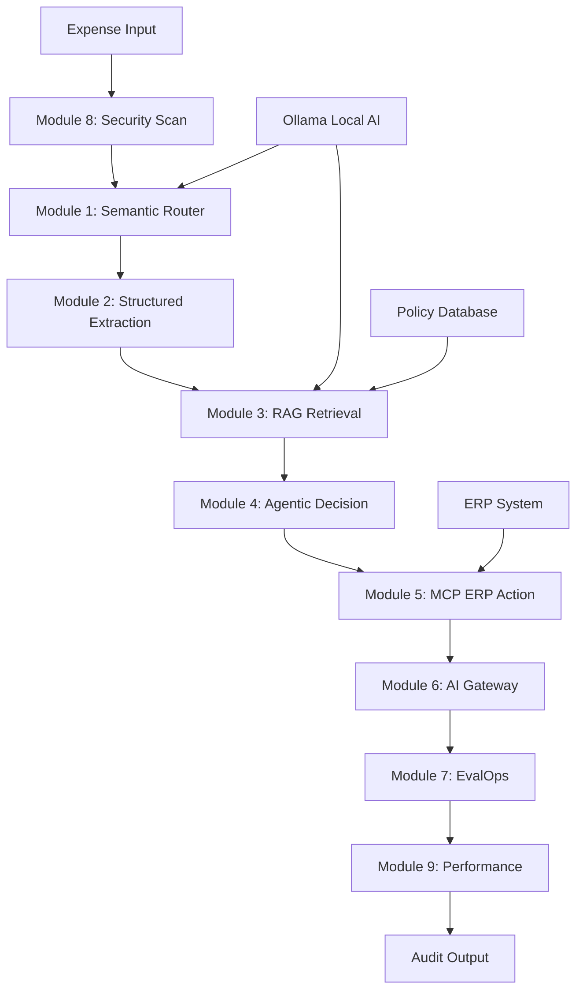

# SnapAudit AI Engineering Fellowship Project

> 🚀 **A comprehensive AI-powered expense auditing system demonstrating advanced AI engineering principles**

[](https://python.org)
[](https://streamlit.io)
[](https://ollama.ai)
[](https://langchain.com)

## 🎯 Quick Start

### Prerequisites

- **Python 3.13+**
- **Ollama** (for local AI models)
- **Git** (for cloning)

### Installation

1. **Clone the repository**

```bash
git clone <repository-url>
cd ai-engineering-fellowship
```

1. **Install dependencies**

```bash
# Using uv (recommended)
uv sync

# Or using pip
pip install -e .
```

1. **Start Ollama**

```bash
ollama serve
```

1. **Pull required models**

```bash
ollama pull gemma3
ollama pull embeddinggemma
```

1. **Set up environment variables**

```bash
# Copy .env.example to .env (if available)
# Set your environment variables in .env file
```

1. **Run the main application**

```bash
# Run the capstone Streamlit app
uv run streamlit run module-10-snapaudit-capstone/streamlit_app2.py
```

## 🌟 What is SnapAudit?

SnapAudit is a **production-grade AI expense auditing system** that processes expense receipts and documents through a sophisticated 10-module pipeline. It demonstrates how to build enterprise AI applications that are:

- 🔒 **Secure & Compliant** - Built-in governance and safety
- ⚡ **Performance Optimized** - Cost and latency aware
- 🤖 **AI-Powered** - Local and cloud AI integration
- 🏢 **Enterprise Ready** - Production-grade architecture

## 🏗️ System Architecture



## 📚 Module Overview

### **🧠 Module 1: Semantic Router**

- **Purpose**: Classify expense types and complexity
- **Technology**: Ollama + LangChain
- **Files**: `router.py`, `router2.py` (Ollama-enabled)
- **Demo**: `streamlit_app.py`, `streamlit_app2.py`

### **📄 Module 2: Structured Generation**

- **Purpose**: Extract structured data from unstructured text
- **Technology**: OpenAI + JSON generation
- **Files**: `receipt_extractor.py`
- **Demo**: `streamlit_app.py`

### **🔍 Module 3: RAG Systems**

- **Purpose**: Retrieve relevant policy information
- **Technology**: Qdrant + BM25 + Ollama embeddings
- **Files**: `rag-systems2.py`, `streamlit_app2.py` (Ollama-enabled)
- **Demo**: `streamlit_app.py`, `streamlit_app2.py`

### **🤖 Module 4: Agentic Workflows**

- **Purpose**: Make intelligent audit decisions
- **Technology**: LangGraph multi-agent system
- **Files**: `test_graph.py`
- **Demo**: `streamlit_app.py`

### **🔐 Module 5: Model Context Protocol**

- **Purpose**: Secure ERP integrations
- **Technology**: MCP + RBAC
- **Files**: `mcp_secure_adapter.py`
- **Demo**: `streamlit_app.py`

### **🚪 Module 6: AI Gateways**

- **Purpose**: Model routing and failover
- **Technology**: Request classification + routing
- **Files**: `ai_gateway_core.py`
- **Demo**: `streamlit_app.py`

### **📊 Module 7: EvalOps & Telemetry**

- **Purpose**: Monitor and evaluate performance
- **Technology**: Metrics collection + evaluation
- **Files**: `evalops_core.py`, `eval.py`
- **Demo**: `streamlit_app.py`

### **🛡️ Module 8: Governance & Safety**

- **Purpose**: Ensure compliance and security
- **Technology**: Content filtering + PII detection
- **Files**: `security_middleware.py`
- **Demo**: `streamlit_app.py`

### **⚡ Module 9: Performance Engineering**

- **Purpose**: Optimize cost and latency
- **Technology**: Semantic caching + batch processing
- **Files**: `perf_cost_core.py`, `perf_benchmark.py`
- **Demo**: `streamlit_app.py`

### **🤖 Module 11: CrewAI Multi-Agent System**

- **Purpose**: Advanced multi-agent orchestration for complex workflows
- **Technology**: Custom CrewAI implementation with Ollama integration
- **Files**: `agents.py`, `tools.py`, `crew.py`, `run_demo.py`, `streamlit_app.py`
- **Demo**: `streamlit_app.py`

#### **Quick Start**

```bash
# Run the CrewAI Streamlit interface
uv run py -m streamlit run crew-ai/streamlit_app.py

# Or run the demo directly
uv run crew-ai/run_demo.py

# Run integration tests
uv run crew-ai/test_integration.py
```

#### **Key Features**

- **Multi-Agent System**: Retriever, Summarizer, and Logger agents
- **Ollama Integration**: Local LLM with configurable models (gemma3, embeddinggemma)
- **Hybrid Retrieval**: Integration with module-3 RAG systems
- **Interactive Interface**: Streamlit-based testing and demonstration
- **Workflow Orchestration**: Configurable multi-step agent workflows
- **Real-time Logging**: Comprehensive execution tracking
- **Environment Configuration**: Flexible setup via .env files

#### **Agent Architecture**

- **Retriever Agent**: Searches and retrieves relevant policy information
- **Summarizer Agent**: Generates summaries and insights from retrieved data
- **Logger Agent**: Tracks and logs all workflow activities
- **Tool Integration**: Seamless integration with external tools and APIs

#### **Configuration**

```bash
# CrewAI environment variables
OLLAMA_BASE_URL=http://localhost:11434
OLLAMA_MODEL=gemma3:latest
OLLAMA_EMBED_MODEL=embeddinggemma:latest

# Optional: OpenAI for fallback
OPENAI_API_KEY=your_openai_api_key_here
```

#### **Usage Examples**

```python
from crew_ai.run_demo import build_demo_crew, demo_run
from crew_ai.streamlit_app import render_execution_results

# Build a crew with retriever
crew = build_demo_crew(hybrid_retriever)

# Run a workflow
results = demo_run(hybrid_retriever, "What is the daily per diem limit?")

# Display results
render_execution_results(results)
```

### **🎯 Module 10: Capstone Integration**

- **Purpose**: Unified system orchestration
- **Technology**: Integration facade + Streamlit UI
- **Files**: `capstone_core.py`, `capstone_core2.py` (Ollama-enabled)
- **Demo**: `streamlit_app.py`, `streamlit_app2.py`

## 🚀 Getting Started Guide

### **Option 1: Quick Demo (Capstone App)**

```bash
# Run the main integrated application
uv run streamlit run module-10-snapaudit-capstone/streamlit_app2.py
```

### **Option 2: Individual Module Exploration**

```bash
# Explore individual modules
uv run streamlit run module-1-semantic-router/streamlit_app2.py
uv run streamlit run module-3-rag-systems/streamlit_app2.py
uv run streamlit run module-8-governance-and-safety/streamlit_app.py
uv run streamlit run crew-ai/streamlit_app.py
```

### **Option 3: Jupyter Notebooks**

```bash
# Launch Jupyter for interactive exploration
jupyter lab

# Open individual module notebooks
# module-1-semantic-router/module-1-semantic-router.ipynb
# module-10-snapaudit-capstone/module-10-snapaudit-capstone.ipynb
# crew-ai/run_demo.ipynb
```

## ⚙️ Configuration

### **Environment Variables**

Create a `.env` file in the project root:

```bash
# Ollama Configuration
OLLAMA_BASE_URL=http://localhost:11434
OLLAMA_EMBED_MODEL=embeddinggemma:latest
OLLAMA_MODEL=gemma3:latest

# OpenAI Configuration (optional, for some modules)
OPENAI_API_KEY=your_openai_api_key_here

# Qdrant Configuration
QDRANT_URL=http://localhost:6333
DEFAULT_COLLECTION=snapaudit_policies

# Other Configuration
LOG_LEVEL=INFO
```

### **Ollama Setup**

```bash
# Install Ollama
curl -fsSL https://ollama.ai/install.sh | sh

# Start Ollama service
ollama serve

# Pull required models
ollama pull gemma3
ollama pull embeddinggemma

# Verify installation
ollama list
```

## 🎮 Usage Examples

### **Basic Expense Auditing**

```python
from module_10_snapaudit_capstone.capstone_core2 import CapstoneEngine

# Initialize the engine
engine = CapstoneEngine()

# Process an expense
expense_text = """
Starbucks Coffee
Date: 2026-03-01
Total: $12.45
Business meeting with team
"""

# Run the complete pipeline
result = engine.run_capstone(expense_text)

# Check the decision
print(f"Decision: {result.agentic['status']}")
print(f"Reason: {result.agentic.get('reason', 'N/A')}")
```

### **Individual Module Usage**

```python
# Security scanning
security_result = engine.module8_scan(expense_text)

# Semantic routing
routing_result = engine.module1_route(expense_text)

# Data extraction
extraction_result = engine.module2_extract(expense_text)

# Policy retrieval
retrieval_result = engine.module3_retrieve("daily per diem limits")
```

## 📊 Monitoring & Logs

### **Viewing Logs**

```bash
# View all logs
tail -f logs/*.log

# View specific module logs
tail -f logs/module-10-snapaudit-capstone_capstone_core2.log
tail -f logs/module-8-governance-and-safety_security_middleware.log
```

### **Performance Monitoring**

```bash
# Run performance benchmarks
uv run python module-9-performance-and-cost-engineering/perf_benchmark.py

# View performance report
cat perf_report.json
```

## 🧪 Testing

### **Run All Tests**

```bash
# Run capstone tests
uv run python module-10-snapaudit-capstone/test_capstone.py

# Run individual module tests
uv run python module-4-agentic-workflows/test_graph.py

# Run CrewAI integration tests
uv run crew-ai/test_integration.py
```

### **Integration Testing**

```python
# Test the complete pipeline
from module_10_snapaudit_capstone.capstone_core2 import sample_capstone_inputs

# Test with sample inputs
samples = sample_capstone_inputs()
for name, text in samples.items():
    result = engine.run_capstone(text)
    print(f"{name}: {result.agentic['status']}")
```

## 🔧 Development Guide

### **Adding New Modules**

1. Create module directory: `module-12-new-feature/`
2. Implement core functionality
3. Add Streamlit demo: `streamlit_app.py`
4. Add Jupyter notebook: `module-11-new-feature.ipynb`
5. Add to capstone integration in `module-10/`

### **Code Style**

- Use Python 3.13+ features
- Follow PEP 8 style guidelines
- Add comprehensive logging
- Include type hints
- Write docstrings

### **Testing Strategy**

- Unit tests for individual functions
- Integration tests for module interactions
- End-to-end tests for complete workflows
- Performance tests for optimization

## 🐛 Troubleshooting

### **Common Issues**

**Ollama Connection Failed**

```bash
# Check if Ollama is running
ollama list

# Restart Ollama
ollama serve

# Check model availability
ollama pull gemma3
```

**Module Import Errors**

```bash
# Check dependencies
uv sync

# Verify environment variables
cat .env

# Check logs for errors
tail -f logs/*.log
```

**Module Import Errors**

```bash
# Check dependencies
uv sync

# Verify environment variables
cat .env

# Check logs for errors
tail -f logs/*.log
```

**CrewAI Connection Issues**

```bash
# Test CrewAI integration
uv run module-11-crew-ai/test_integration.py

# Check Ollama connection
curl -s http://localhost:11434/api/tags

# Test individual components
uv run module-11-crew-ai/run_demo.py
```

**Performance Issues**

```bash
# Check system resources
htop

# Monitor Ollama
docker stats

# Run performance benchmark
uv run python module-9-performance-and-cost-engineering/perf_benchmark.py
```

### **Getting Help**

1. Check the logs in `logs/` directory
2. Review module-specific README files
3. Test individual modules before integration
4. Verify environment configuration

## 📈 Performance Tips

### **Optimization Recommendations**

- Use local Ollama models for privacy and cost control
- Enable semantic caching for repeated queries
- Monitor token usage and costs
- Use batch processing for multiple requests
- Configure appropriate model sizes for tasks

### **Cost Management**

- Prefer local models when possible
- Monitor token usage in real-time
- Use semantic caching to reduce API calls
- Optimize prompts for efficiency
- Set up cost alerts and limits

## 🤝 Contributing

### **Development Workflow**

1. Fork the repository
2. Create feature branch
3. Make changes with tests
4. Update documentation
5. Submit pull request

### **Code Review Guidelines**

- Ensure all tests pass
- Check for security implications
- Verify performance impact
- Update documentation
- Follow coding standards

## 📄 License

This project is part of the AI Engineering Fellowship and demonstrates advanced AI engineering principles and practices.

## 🙏 Acknowledgments

- **AI Engineering Fellowship** - For the comprehensive curriculum
- **LangChain** - For the excellent AI framework
- **Ollama** - For local AI deployment capabilities
- **Streamlit** - For the rapid prototyping tools

---

## 🎯 Next Steps

### **For Learners**

1. Explore individual modules to understand concepts
2. Run the capstone to see integration
3. Experiment with different configurations
4. Build your own extensions

### **For Developers**

1. Review the architecture patterns
2. Adapt for your use cases
3. Contribute improvements
4. Share your experiences

### **For Organizations**

1. Evaluate for production use
2. Customize for your policies
3. Integrate with your systems
4. Scale for your needs

---

**🚀 Ready to start your AI engineering journey?**

Check out the [ABOUT.md](./ABOUT.md) for detailed project information and dive into the modules that interest you most!
